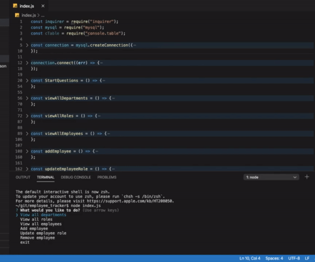

# Employee Tracker

Command line application that allows user to keep a record of employees and their given role in a company

## Table Of Contents
- [User Story](#User-Story)
- [Technology](#Technology)
- [Link to depolyed app](#Link-to-depolyed-app)

## User Story
```
As a buisness owner 
I want to be able to maintain a list of employees
So that I can add to, update and delete from it as well as view details about each
```

## Technology
* Javascript
* Node.js
* Axios
* MySQL

## Installation
Install node.js
Run an 'npm install' to get dependecies
Run 'node index.js' to start application

# Demonstration


https://www.youtube.com/watch?v=n8Z_Mh6tdRQ&feature=youtu.be